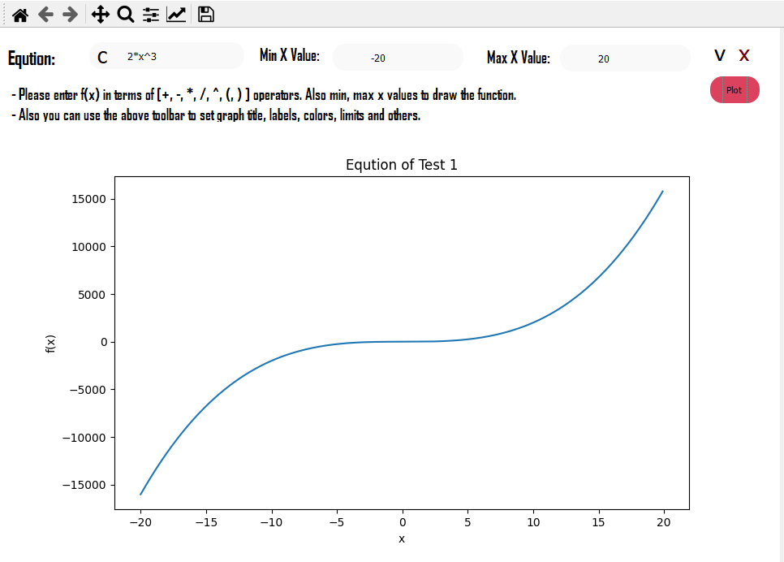

# Function Plotter

## Table of Content:

<ul>
  <li><a href="#des">Description</a></li>
  <li><a href="#ins">Installation</a></li>
  <li><a href="#run">Running</a></li>
  <li><a href="#te">Tests</a>
    <ul>
      <li><a href="#we">Working Tests</a></li>
      <li><a href="#et">Errors Tests</a></li>
    </ul>
  </li>
  <li><a href="#at">Automatic Testing</a></li>
</ul>

<a id="des"></a>

## Description

A GUI program that plots a function entered by the user.

<a id="ins"></a>

## Installation Steps:

- Packages:

```
pip install pyqt5
pip install pyqt5-tools
```

- Program

```
git clone https://github.com/KamelMoohamed/Function_Plotter.git
cd Function_Plotter
py mainwindow.py
```

<a id="run"></a>

## Running Steps:

- Take a f(x) from the user in terms of [+, -, *, /, ^, (, )].
- Take the x boundries (min, max) x values.
- It has 2 Algorithm inside to calculate the function value. <br>by default it's interpretre, you can change it to the second algorithm `eval` by changing the line 303 to `self.update_graph(interpreter = False)`)

<a id="te"></a>

## Testing

<a id="we"></a>

### Working Examples:

> ### Test 1

\




<br>

> ### Test 2

\


<br>

> ### Test 3
>
> \
> 

<br>
<a id="et"></a>

> ## Errors Tests

\


<a id="at"></a>

## Automatic Testing

- I used the unittest package in Python to test all possible inputs the the two solving alogorithms.
